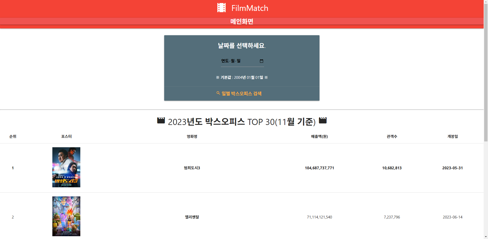
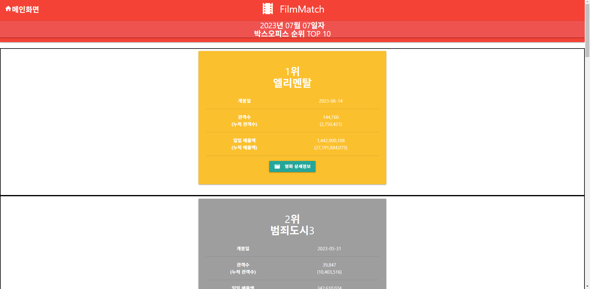

# :movie_camera:FilimMatch

## :bulb:프로젝트 소개

프로젝트 기간 : 2023.11 ~ 2023.12
인원 : 2인

## :clipboard:기술스택

## :computer:주요화면
### 메인화면

- 연도별 박스오피스 랭킹을 출력합니다.
- 일간 박스오피스 랭킹을 검색할 수 있습니다.

### 검색결과

- 사용자가 입력한 날짜의 일간 박스오피스 순위를 확인할 수 있습니다.

### 상세페이지

- 선택한 영화의 주요 상세 정보를 확인할 수 있습니다.

### GIF

## 비고

